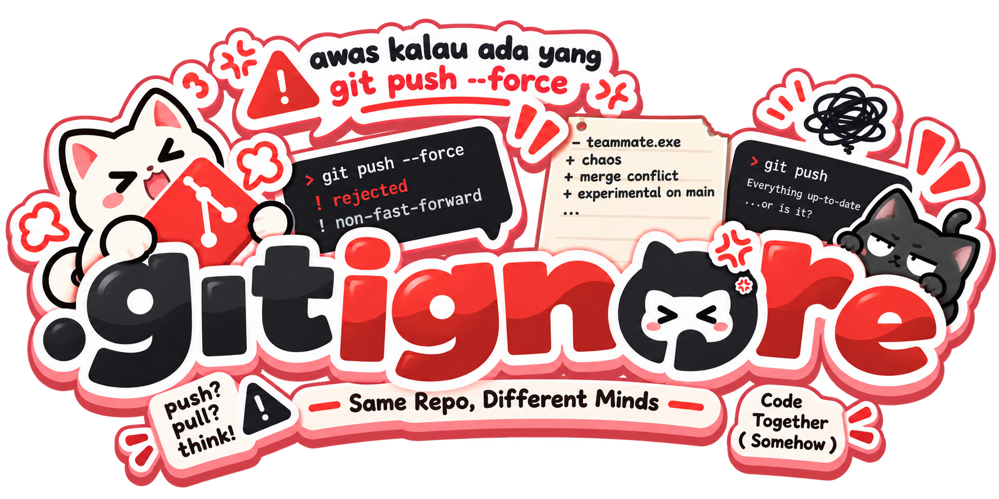

  
  
  
  

> I like Full-stack Web Development, Minecraft Modding, and Hardware Troubleshooting.

A student and tech enthusiast who builds things just for the fun of it. My curiosity drives me to understand how systems work under the hood from writing modern web applications and mobile applications to setting up servers.

## What I do

-  Full-stack web development
-  Minecraft server modding & scripting
-  Server administration & Cloudflare management
-  Discord bot scripting
-  AI experiments & integrations

## Projects

-  **[IOnLearn](https://github.com/bluebleaze/IOnLearn)**
-  **[Puzzle-Pixel-Game](https://github.com/DarkIgnite/Puzzle-Pixel-Game)**
-  secret?

## Currently learning

`Laravel` `React` `TailwindCSS` `Inertia.js` `JavaScript` `3D Printing` `Mobile Programming` `artificial intelligence`

## .gitignore team
  
 
    
  

  

### Chaotic Team that exist <i>somehow...</i>
- [bluebleaze](https://github.com/bluebleaze) 
- [inihelta](https://github.com/inihelta)

> Eat, Sleep, Code, Repeat.
